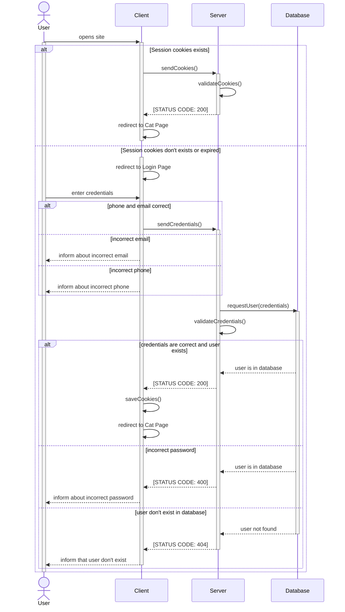

```mermaid
sequenceDiagram
    actor User;
    participant Client;
    participant Server;
    participant Database;

    User->>+Client: opens site;
    activate User;

    alt Session cookies exists
        Client->>+Server: sendCookies();
        Server->>Server: validateCookies();
        Server-->>-Client: [STATUS CODE: 200];
        Client->>-Client: redirect to Cat Page;
    else Session cookies don't exists or expired
        activate Client;
        Client->>Client: redirect to Login Page;

        User->>Client: enter credentials;

        alt phone and email correct
            Client->>+Server: sendCredentials();
        else incorrect email
            Client-->>User: inform about incorrect email;
        else incorrect phone
            Client-->>User: inform about incorrect phone;
        end

        Server->>Database: requestUser(credentials);
        activate Database;
        Server->>Server: validateCredentials();


        alt credentials are correct and user exists
            Database-->>Server: user is in database;
            Server-->>Client: [STATUS CODE: 200];
            Client->>Client: saveCookies();
            Client->>Client: redirect to Cat Page
        else incorrect password
            Database-->>Server: user is in database;
            Server-->>Client: [STATUS CODE: 400];
            Client-->>User: inform about incorrect password;
        else user don't exist in database
            Database-->>Server: user not found;
            deactivate Database;
            Server-->>-Client: [STATUS CODE: 404];
            Client-->>-User: inform that user don't exist;
        end
    end
    deactivate User;
```
