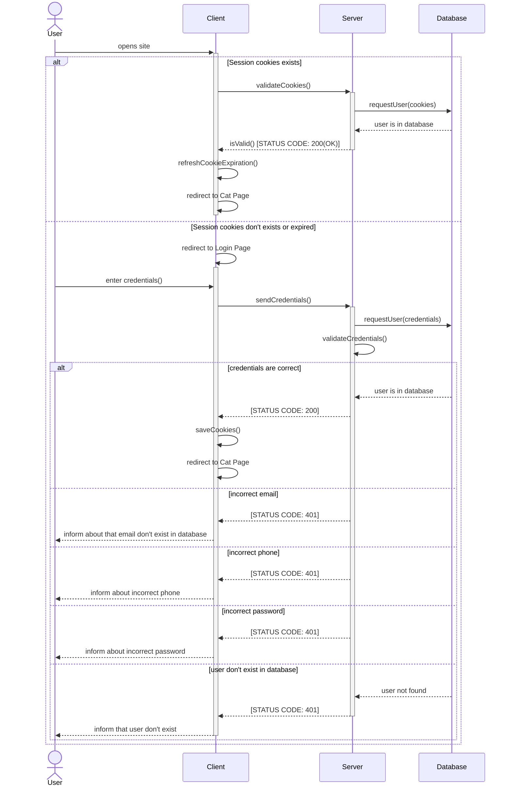

```mermaid
sequenceDiagram
    actor User;
    participant Client;
    participant Server;
    participant Database;

    User->>+Client: opens site;

    alt Session cookies exists
        Client->>+Server: validateCookies();
        Server->>Database: requestUser(cookies);
        Database-->>Server: user is in database;
        Server-->>-Client: isValid() [STATUS CODE: 200(OK)];
        Client->>Client: refreshCookieExpiration();
        Client->>-Client: redirect to Cat Page;
    else Session cookies don't exists or expired
        Client->>+Client: redirect to Login Page;

        User->>Client: enter credentials();
        Client->>+Server: sendCredentials();
        Server->>Database: requestUser(credentials);
        Server->>Server: validateCredentials();


        alt credentials are correct
            Database-->>Server: user is in database;
            Server-->>Client: [STATUS CODE: 200];
            Client->>Client: saveCookies();
            Client->>Client: redirect to Cat Page
        else incorrect email
            Server-->>Client: [STATUS CODE: 401];
            Client-->>User: inform about that email don't exist in database;
        else incorrect phone
            Server-->>Client: [STATUS CODE: 401];
            Client-->>User: inform about incorrect phone;
        else incorrect password
            Server-->>Client: [STATUS CODE: 401];
            Client-->>User: inform about incorrect password;
        else user don't exist in database
            Database-->>Server: user not found;
            Server-->>-Client: [STATUS CODE: 401];
            Client-->>-User: inform that user don't exist;
        end
    end
```
